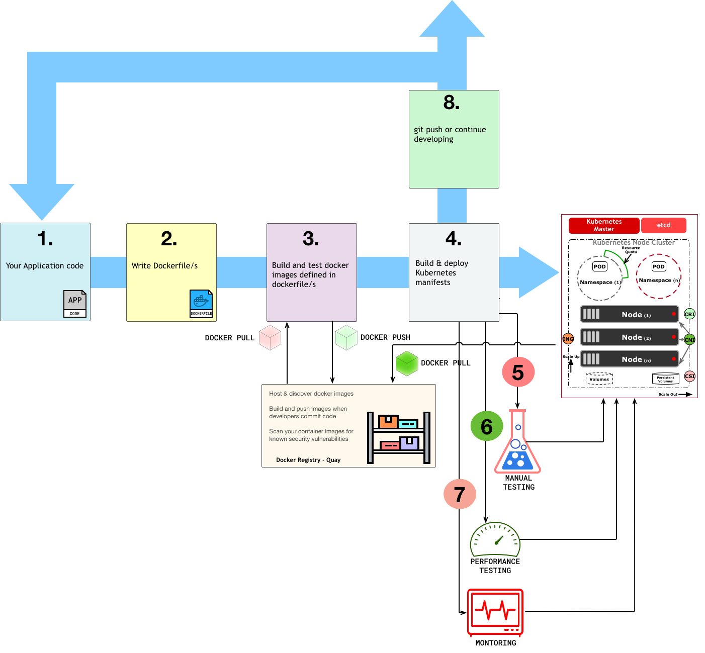

## Container Local Development Environment
Getting started with any distributed system that has several components expected to run on different servers can be challenging. Often developers and administrators want to be able to take a new system for a spin before diving straight into a full-fledged deployment on a cluster.

All in one installations are a good remedy to this challenge. They provide a quick way to test a new technology by getting a working setup on a local machine. They can be used by developers in their local workflow and by system administrators to learn the basics of the deployment setup and configuration of various components.

## Note
The master branch of this repository now tracks RedHat OpenShift, if you would like to deploy CoreOS Tectonic based local development environment then please checkout git branches named [Tectonic-*](https://github.ford.com/Containers/localdev/branches)

## Audience
- Developers
- Continuous Integration (testing)
- Prospective Customers/Users (kick the tires)
- Kubernetes/OpenShift operators

## Goals
- Enable **free**, **local** demonstration of the core capabilities of Kubernetes
- Deploy, test, and debug development versions of Kubernetes Services, and built docker container images.
- Decrease the cycle time from local code-change to deployment and testing
- Support multiple use cases to facilitate sharing of pain and gain
- Stay as close to the process of production deployment as possible to reduce maintenance cost of multiple deployment methods
- Facilitate onboarding of new Tectonic users by preferring intuitive usability over complex configuration

## Minimum Requirements
1. Install supported operating system (MacOS, Windows 10, Linux) with atleast 8GB of Memory and 4 CPU to assign to the VM
1. Dependecies
    1. [Git](https://git-scm.com/downloads)
    1. [Vagrant v2.1.0+](https://www.vagrantup.com/downloads.html)
    1. [VirtualBox v5.2.12+](https://www.virtualbox.org/)
    1. NFS, resolvconf (Linux only)
1. [Powershell 5+](https://docs.microsoft.com/en-us/powershell/scripting/setup/installing-windows-powershell?view=powershell-6) and [7zip](https://www.7-zip.org/a/7z1801-x64.exe) (windows only requirement)


## Quick Start
1. Clone
    ```
    git clone https://github.ford.com/Containers/localdev

    or

    git clone git@github.ford.com:Containers/localdev.git

    cd localdev
    ```
1. Execute the command to install [OpenShift Enterprise](https://www.openshift.com/):
    ```
    vagrant up --provision
    ```
    > ⚠ NOTE: On windows you should execute these commands in powershell running in administrative context.

    > ☕ Take break, this steps take about 20 - 25 minutes to complete

1. Execute the command to install [OpenShift Origin](https://www.openshift.org/):
    ```
    OPENSHIFT_DEPLOYMENT_TYPE='origin' vagrant up
    ```
    > ⚠ NOTE: On windows you should execute these commands in powershell running in administrative context.

    > ☕ Take break, this steps take about 20 - 25 minutes to complete

1. Access the GUI [https://console.oc.local:8443](https://console.oc.local:8443)
    ```
    Username: admin
    Password: sandbox
    ```

## Localdev workflow



## Default service endpoints

| Component                           | Details                                               |
| :---------------------------------- | :---------------------------------------------------- |
| All-in-one node                     | m1.oc.local                                           |
| Master/Worker SSH Username          | vagrant                                               |
| SSH Private key                     | ~/.vagrant.d/insecure_private_key                     |
| Openshift web console               | https://console.oc.local:8443                         |
| Default username                    | __admin__                                             |
| Default password                    | __sandbox__                                           |
| Docker registry                     | https://registry-console-default.apps.oc.local/       |
| Kibana web console (Logging)        | https://kibana.apps.oc.local/                         |
| Prometheus web console (Monitoring) | https://prometheus-openshift-metrics.apps.oc.local/   |
| Prometheus alert manager            | https://alertmanager-openshift-metrics.apps.oc.local/ |
| File StorageClass (default)         | glusterfs-storage                                     |
| Block StorageClass                  | glusterfs-storage-block                               |
| Wildcard Ingress URI                | *.apps.oc.local                                       |
| KUBECONFIG                          | ./artifacts/.kube/config                              |

## Advanced configurations
The installer support customization through environment variables, that can be provide at command like for example:
```bash
# On MacOS and Linux
export MASTER_VM_MEMORY='8192'
export MASTER_VM_CPUS='4'
```

```powershell
# On Windows
$env:MASTER_VM_MEMORY = '8192'
$env:MASTER_VM_CPUS = '4'
```

few important variables are listed below, note that logging and monitoring components inspite of being offered minimum resource (CPU, Memory) still consume about 2GB of memory. If you do not need them you disable these features.

| Environment variable           | Default                            | Commentary                   |
| :----------------------------- | :--------------------------------- | :--------------------------- |
| MASTER_VM_MEMORY               | computed (50% of host)             |                              |
| MASTER_VM_CPUS                 | computed (50% of host)             |                              |
| DEFAULT_HTTP_PROXY             | http://mycorp.com:83               |                              |
| DEFAULT_HTTPS_PROXY            | http://mycorp.com:83               |                              |
| DEFAULT_NO_PROXY               | computed see source                |                              |
| ENABLE_HTTP_PROXY              | computed see source                | Should http proxy be enabled |
| OPENSHIFT_USE_CALICO_SDN       | true                               | Use calico as cluster SDN    |
| OPENSHIFT_DEPLOY_LOGGING 🚩    | true                               | Deploy EFK logging stack     |
| OPENSHIFT_DEPLOY_MONITORING 🚩 | true                               | Deploy Prometheus            |


## Synced Folders
Synced folders enable Vagrant to sync a folder on the host machine to the guest machine, allowing you to continue working on your project's files on your host machine, but use the resources in the guest machine to compile or run your project.

By default, Vagrant will share your project directory (the directory with the Vagrantfile) to `/home/vagrant/share` inside the virtual machine.

If you would like to sync additional host folder then define an environment variable `ADDITIONAL_SYNCED_FOLDERS` that list a comma delimited strings `source1=>destination1, source2=>destination2` for example:

```bash
# On Linux & MacOS
export ADDITIONAL_SYNCED_FOLDERS='/some/directory/on/host/my-dir => /my-dir, /some/directory/on/host/testdir = /home/core/testdir'
```

```powershell
# On Windows
$env:ADDITIONAL_SYNCED_FOLDERS = 'c:/some/directory/on/host/my-dir => /my-dir,c:/some/directory/on/host/testdir = /home/core/testdir'
```

> Note that `=>` and `=` is supported delimiter

## Cluster lifecycle management

The recommended way to shut down a cluster is to destroy it (removing the the VMs and deleting their disks):

```
vagrant destroy -f
```

If you need to preserve the state of the cluster, use suspend/resume, which stores and restores memory state:

```
vagrant suspend
vagrant resume
```

# How Do I...?
- OpenShift Docs - https://docs.openshift.com/
- Report a Issue - https://github.com/spuranam/ldev/issues
- Contribute - https://github.com/spuranam/ldev

# Know Issues:
- Localdev does not work when connect to Ford VPN servers on Windows platform using Cisco AnyConnect client since Ford’s AnyConnect configuration disables split tunneling. On MacOS workaround is to use native Cisco IPSec support instead of Cisco AnyConnect client.
- When switching networks on Windows, you must first [destroy](docs/usage.md#shutting-down-and-deleting-your-cluster) running localdev instances otherwise you will have trouble with your name resolution.
- Localdev DNS server is configured to only support TCP/IP version 4, hence on windows you must disable TCP/IP version 6 if its enabled.
